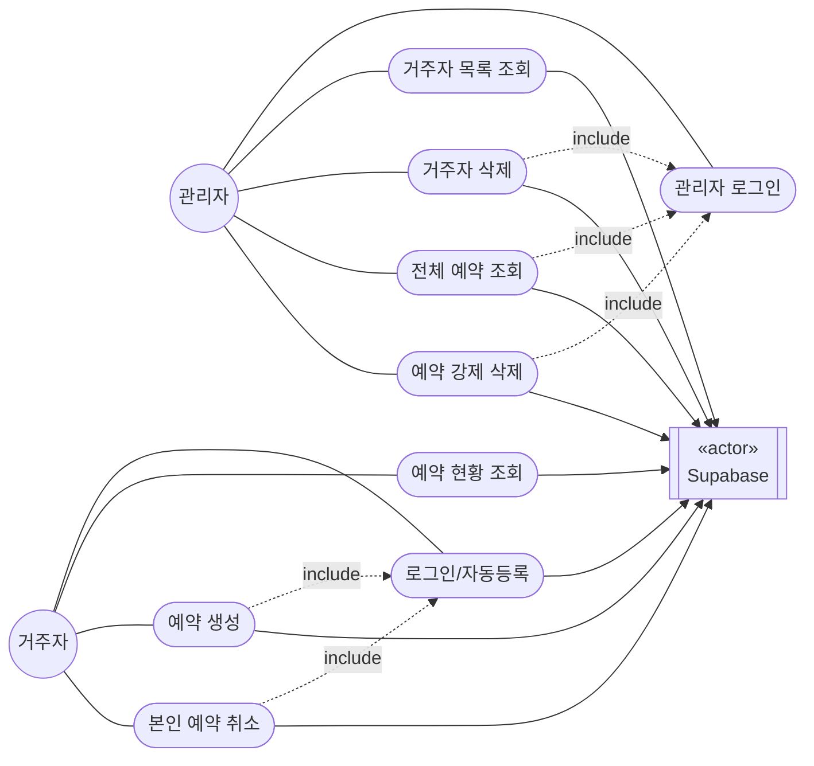

# 세탁실 예약 시스템 — 유스케이스 다이어그램

소프트웨어공학 수업(요구사항 분석 - 유스케이스 다이어그램) 4단계 작성 절차를 실제 서비스에 적용한 문서.

## 1단계: 액터 식별

| 액터 | 설명 |
|---|---|
| 거주자 (Resident) | 호실 + 이름으로 로그인하는 일반 사용자. 최초 로그인 시 자동 등록 |
| 관리자 (Admin) | 비밀번호(ADMIN_PASSWORD)로 인증 후 `/admin` 접근 |
| Supabase | 시스템 액터 — 예약/사용자 데이터를 저장하는 외부 DB. 개발 범위 밖이지만 모든 유스케이스가 참조 |

거주자와 관리자는 모두 "사용자" 개념을 공유하지만, 관리자는 별도 인증(세션스토리지)과 별도 화면(views/admin.html)을 쓰므로 **일반화 관계로 묶지 않고 독립 액터**로 둔다. (관리자가 예약 기능을 쓰지 않기 때문)

## 2단계: 액터별 후보 유스케이스 도출

`server.js` 라우트 기준으로 도출:

**거주자**
1. 로그인/자동등록 (`POST /api/login`)
2. 예약 현황 조회 (`GET /api/reservations`)
3. 예약 생성 (`POST /api/reservations`)
4. 본인 예약 취소 (`DELETE /api/reservations/:id`)
5. 이름 변경
6. 다크모드 토글

**관리자**
1. 관리자 로그인 (`POST /api/admin/login`)
2. 거주자 목록 조회 (`GET /api/admin/users`)
3. 거주자 삭제 (`DELETE /api/admin/users/:room`)
4. 전체 예약 조회 (`GET /api/admin/reservations`)
5. 예약 강제 삭제 (`DELETE /api/admin/reservations/:id`)

## 3단계: 관계 식별 및 검토

- **다크모드 토글**: 서버 API가 없는 순수 프론트(localStorage) 기능 → 백엔드 유스케이스가 아니라 UI 이벤트 흐름으로 간주, **유스케이스에서 제외**
- **이름 변경**: 별도 API 없이 재로그인 시 갱신되는 구조 → 로그인 유스케이스의 **이벤트 흐름**으로 흡수 (홀로 존재하는 유스케이스이므로 재검토 대상)
- **예약 생성**과 **예약 취소**는 둘 다 "본인 인증된 상태"를 전제로 하므로, 두 유스케이스 모두 **로그인**을 `<<include>>` 관계로 참조
- **거주자 삭제**와 **예약 강제 삭제**도 마찬가지로 **관리자 로그인**을 `<<include>>`
- 관리자와 거주자는 동일한 "예약 조회" 데이터를 보지만 표현 방식(테이블 vs 타임라인)이 달라 **별개 유스케이스로 유지**

## 4단계: 정제 — 최종 유스케이스 다이어그램

### 관계 해석 (자연어)

- 거주자는 예약을 하기 위해 시스템과 상호작용한다. 예약을 하기 위해서는 로그인(인증)을 반드시 수행해야 한다.
- 거주자는 본인 예약을 취소하기 위해 시스템과 상호작용한다. 취소를 하기 위해서도 로그인을 반드시 수행해야 한다.
- 관리자는 거주자/예약 데이터를 관리할 목적으로 시스템과 상호작용한다. 관리 기능을 쓰기 위해서는 관리자 로그인을 반드시 수행해야 한다.
- 모든 유스케이스는 Supabase(시스템 액터)의 데이터 저장/조회 서비스를 필요로 한다.
